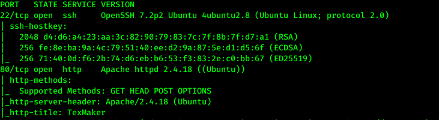
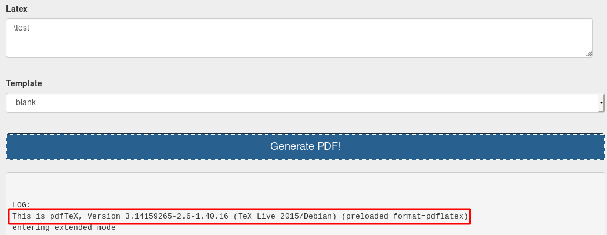

# LaxCTF

## Enumeration

Starting with an nmap scan, we find that port 22 and 80 are the only open ports. `sudo nmap -Pn -v -A 10.10.214.57`

On the site at port 80 it seems like we can create PDFs from latex commands. Submitting something random gives away that `pdfTex` is used backend for the conversion.

We see that version `3.14159265-2.6-1.40.16` is used. I found [this article on exploting pdflatex](https://0day.work/hacking-with-latex/) which might give us some help proceeding.