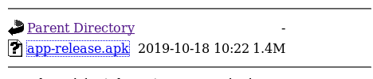

# LaxCTF

## Enumeration

Starting with an nmap scan, we find that port 22 and 80 are the only open ports. `sudo nmap -Pn -v -A 10.10.214.57`


On the site at port 80 it seems like we can create PDFs from latex commands. Submitting something random gives away that `pdfTex` is used backend for the conversion.


After some googling I found [this article on exploiting moodle and latex rendering](https://www.exploit-db.com/exploits/8297) which might give us some help proceeding.
In the article they say that earlier moodle versions are vulnerable for lfi attacks. Using this command `$$ \input{<path/to/file>} $$` we might be able to read files on the system. The `/etc/passwd` file is a good starting point, since we don't know of any other files on the system.

Thus we will try to render the `$$ \input{/etc/passwd} $$` command.

Scrolling down to the response section we see a whole lot of users, and at the end something that looks like a secret `/opt/secret`


Interesting...let's try to display the contents of this secret file `$$ \input{/opt/secret} $$`

A new pdf is created when the command is executed.


Uh oh! The PDF seems to be completely empty...but is it really?


Pressing `ctrl + a` and `ctrl + c` we copy the text in the PDF, which simply is out of bounds.

Pasting the text into a file editor reveals that the PDF was not empty at all. The first few characters of this string reveals that the string is encrypted with AES (Advanced encryption standard) using CBC (cipher block chaining) and a 128 bit key. 


We need a decryption key in order to get access to whatever is hidden, so let's continue with our enumeration.

Booting up gobuster to look for hidden directories `gobuster dir -u http://10.10.230.202 -w /usr/share/dirbuster/wordlists/directory-list-2.3-medium.txt -t 40` gives us an unusual diretory called `Google-Earth`.


This directory only contains a single file called app-realease.apk. APKs are file packages for Android devices. Let's download the file and check it out.



Using the `apktool d app-release.apk` command, we unpack the APK file, and with `grep -rnw 'app-release' -e 'AES'` you find all the files containing the string `AES` in the `app-release` folder. Lucky for us there seem to be a couple of results.


Heading to the file that contains `AES` we see a decryption key and an initialization vector.


Decryption key `sUp3rCr3tKEforL!`

Initialization vector `sUp3rCr3tIVforL!`

Using `OpenSSL` we try to decrypt the file. It is important to note that the IV and Key must be encoded as hex in order for OpenSSL to be able to use it.


The first line of the file that contains `AES/CBC/128 ` must be removed because it's not part of the encryption. We further see that the file is encoded by base64, so that must be first be decoded before OpenSSL can decrypt it.

That gives us this command 

`base64 -d secret| openssl aes-128-cbc -d -out secretDecrypted -iv '7355703372437233744956666f724c21' -K '7355703372437233744b45666f724c21'`

```
----[---->+<]>--.+[--->+<]>+.[--->+<]>+.[->+++++<]>+.[----->+<]>+.++.[--->+<]>--.>-[--->+<]>-.+++.+[----->+<]>.-----------.>+[--->++<]>.>-[-
[...]
+.---.---[-->+++<]>--.-[--->++<]>+.>-[----->+<]>-.[->++<]>.+[--->+<]>.-[++>---<]>-.[----->+<]>---.>+[--->++<]>.
```

This looks a lot like `brainfuck` encoding, so let's try to decode it. The decoded text from [this site](https://www.splitbrain.org/_static/ook/) looks like reversed base64 encoding.


Reverse to base64 `echo "=kzcHJl[...]mV" | rev`

