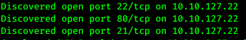
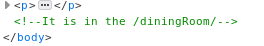
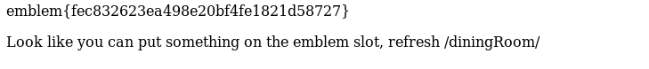
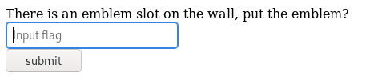
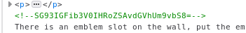
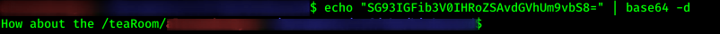

# Biohazard

## Introduction

We run `sudo nmap -Pn -v -A 10.10.127.22` command to discover that there is a total of _three_ open ports.

2. How many open ports?
    * 3

By heading to the website at port 80 we immediately see the team name
3. What is the team name in operation?
    * STARS alpha team

## Mansion

By pressing the _mansion_ hyperlink at the index.html, we're taken to _/mansionmain/_. In the source code of the website we see a comment that takes us to _/diningRoom/_.

We press the only hyperlink and take the emblem off the wall. 

1. What is the emblem flag?
    * emblem{fec832623ea498e20bf4fe1821d58727}

Heading back to the _/diningRoom/_ as instructed, we see that there is now a place to enter a flag.

I tried to enter the emblem we just found, but to no avail. Looking at the source code again, we see yet another string of characters.

We can immediately see that this string is encoded with _base64_. Decoding the string gives us this

In the _/teaRoom/_ we press the _Lockpick_ link to obtain the lockpick flag.

2. What is the lockpick flag?
    * lock_pick{037b35e2ff90916a9abf99129c8e1837}